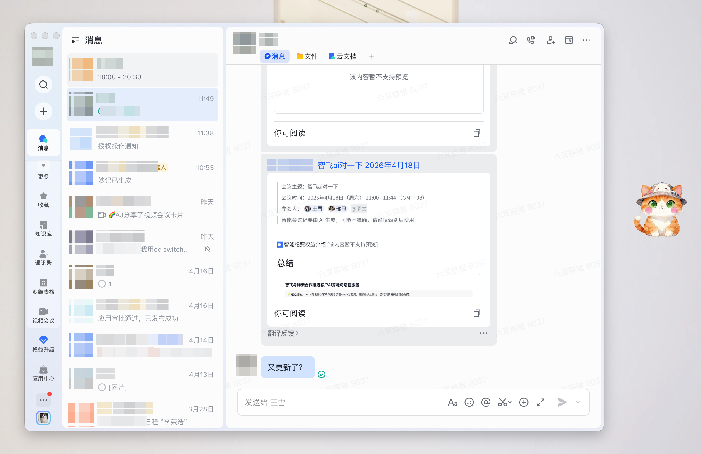
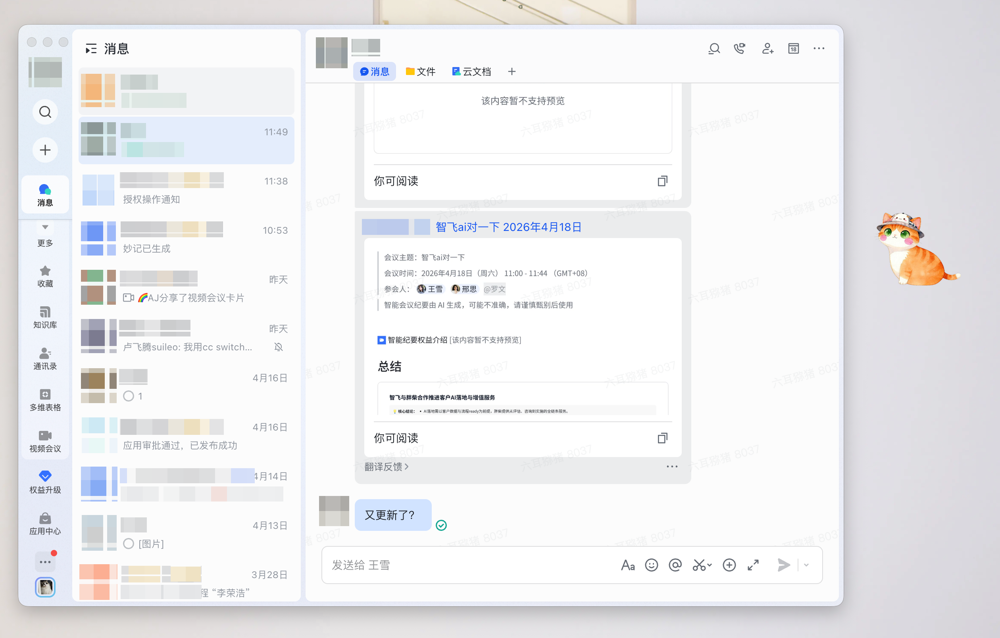
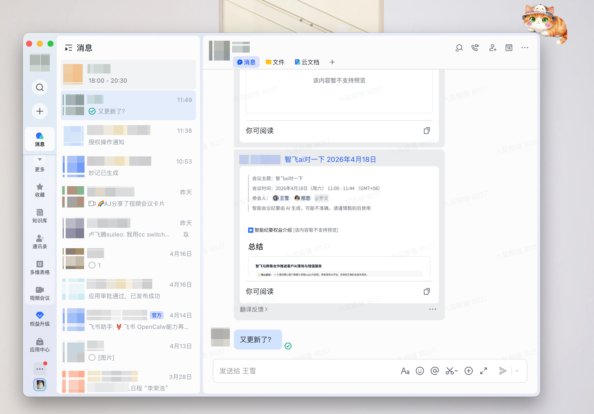
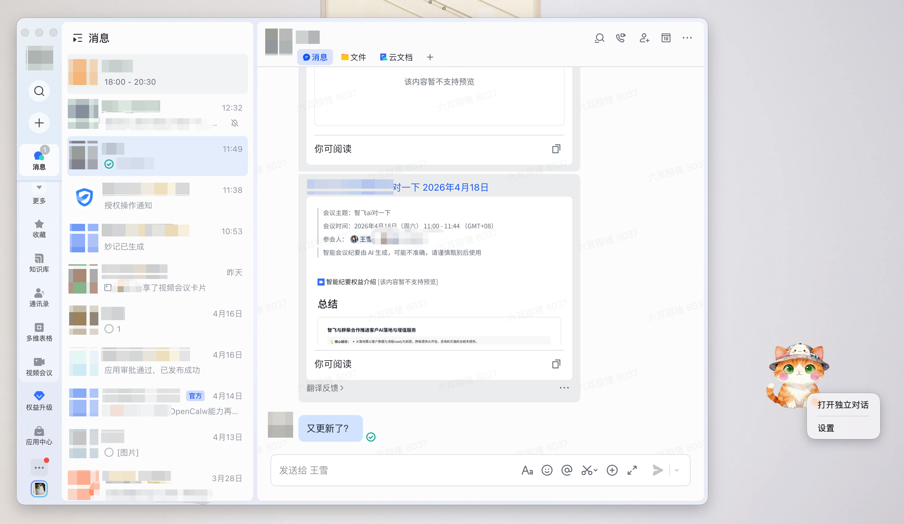
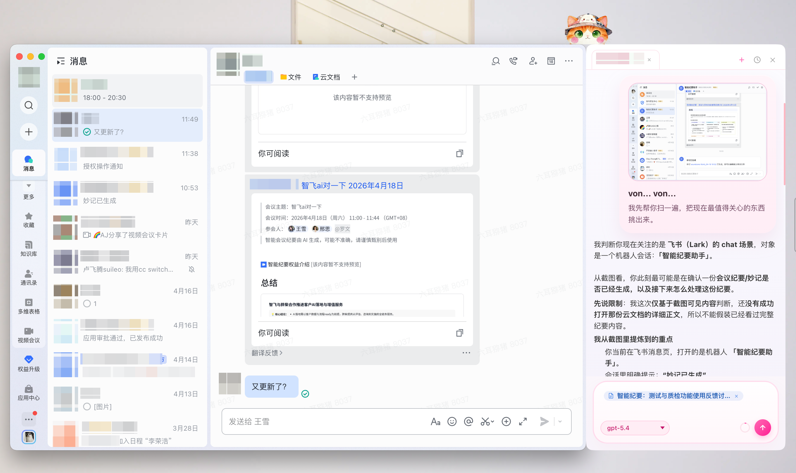
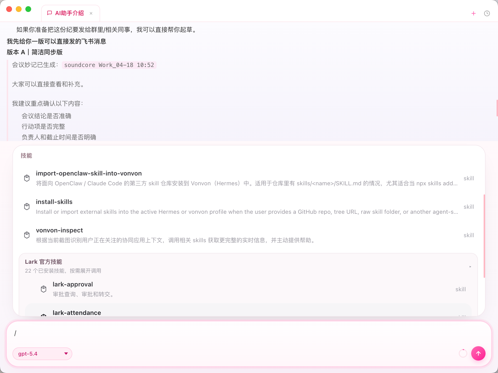
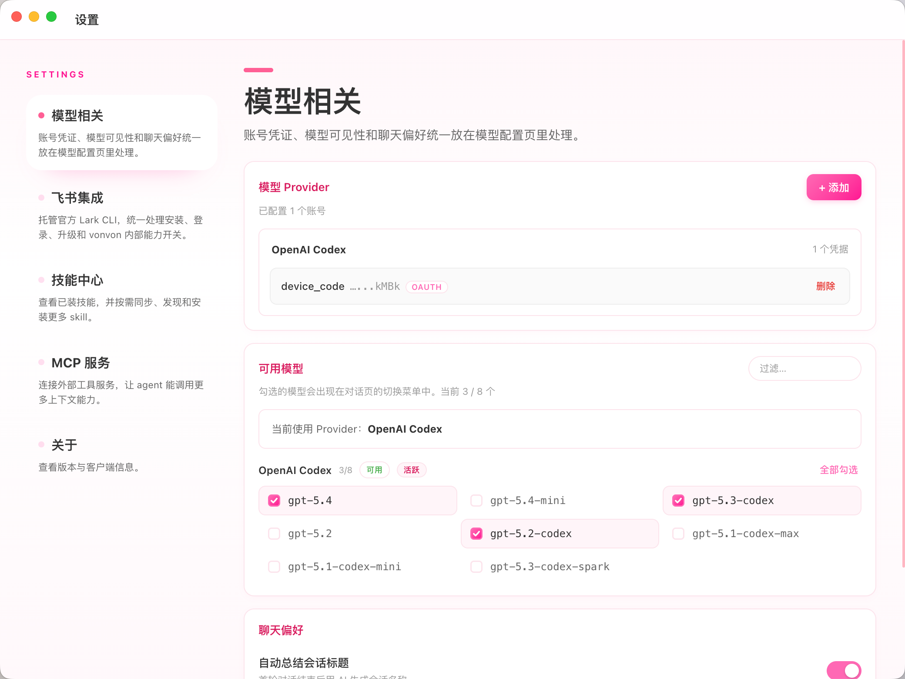
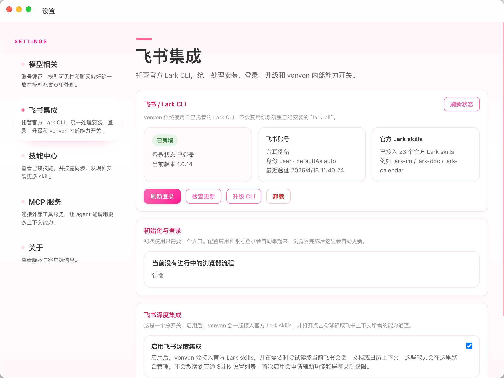
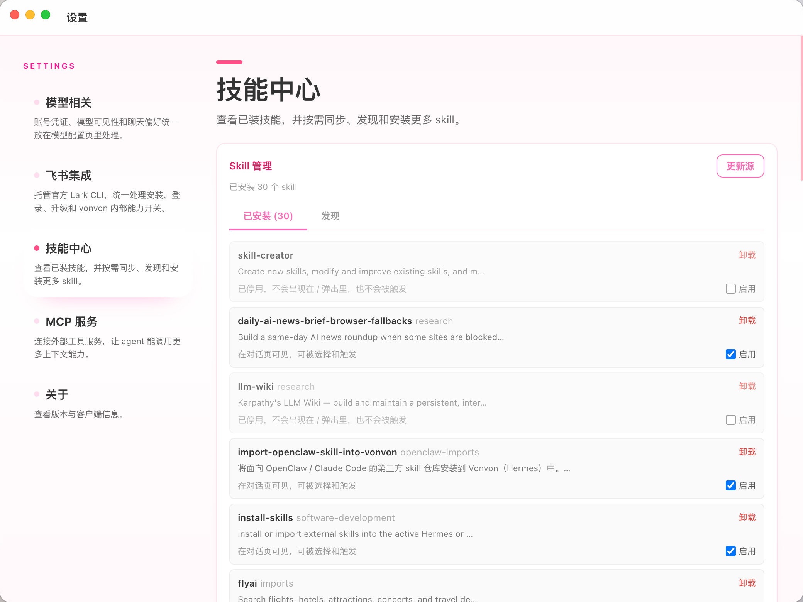
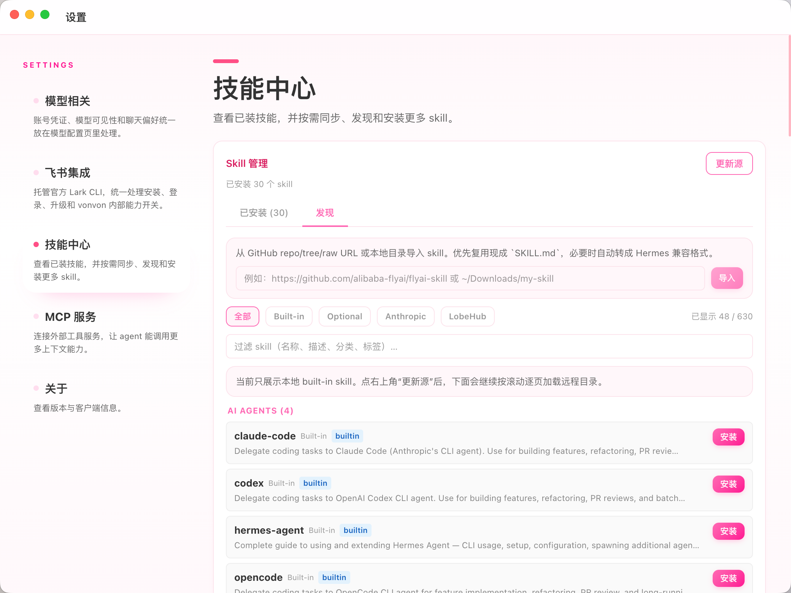

# Vonvon

> 一只住在 macOS 桌面的 AI 宠物。平时安静待命，靠近飞书会进入协作状态，还会沿着你的使用方式慢慢长出新的能力。

`macOS 12+` `Apple Silicon` `OpenAI / OpenAI Codex / Anthropic` `Feishu / Lark` `Skills` `MCP`

Vonvon 不是把网页聊天窗口搬到桌面，也不是传统意义上的工具浮窗。它更像一个会观察情境、会贴着工作流生长的桌面角色：

- 它的灵感，也来自那只在家里陪我一起办公的小猫咪
- 平时存在感很低，需要时再被唤起，不打断当前节奏
- 靠近飞书右侧时会自动吸附，进入更深入的协作状态
- 基于 Hermes Agent 的能力，它可以在使用过程中逐步演化出新的 skill
- 也可以继续通过 Skills 和 MCP 接入更多外部能力
- 用得越久，越会形成更贴手的协作方式

## 界面预览

### 主形态与飞书吸附视图

<table>
  <tr>
    <td align="center" width="50%">
      
      <br />
      <sub>日常使用时的常规主形态</sub>
    </td>
    <td align="center" width="50%">
      
      <br />
      <sub>靠近飞书右侧边时，会进入吸附状态</sub>
    </td>
  </tr>
  <tr>
    <td align="center" width="50%">
      
      <br />
      <sub>仍处于吸附状态，但侧边聊天框已经收起</sub>
    </td>
    <td align="center" width="50%">
      
      <br />
      <sub>从浮窗菜单进入“打开独立对话”</sub>
    </td>
  </tr>
</table>

当 Vonvon 靠近飞书窗口右侧边时，会进入吸附状态。这个窗口级吸附目前只对飞书生效，不会随意贴到其他应用窗口上。

### 飞书侧边协作



这是 Vonvon 最有辨识度的能力之一。

当 Vonvon 已吸附到飞书、并展开侧边聊天框后，双击 Vonvon，它会先看一眼当前飞书界面的截图，再结合托管的飞书 CLI 拉取更完整的真实上下文，包括截图之外的对话、截图里飞书文档的具体内容，以及当前协作场景里的更多信息，然后再给出总结、判断和下一步建议。

### 独立窗口使用



不吸附飞书时，Vonvon 也可以直接作为独立窗口使用。你可以从浮窗菜单进入“打开独立对话”，进入后的界面更适合连续多轮对话、长任务处理和更沉浸的工作流。

### 设置与能力管理

<table>
  <tr>
    <td align="center" width="50%">
      
      <br />
      <sub>模型账号、可见模型和聊天偏好统一在这里配置</sub>
    </td>
    <td align="center" width="50%">
      
      <br />
      <sub>飞书登录、飞书 CLI 状态和深度集成能力都在这里管理</sub>
    </td>
  </tr>
  <tr>
    <td align="center" width="50%">
      
      <br />
      <sub>查看已经装上的 skill，并决定哪些能力出现在对话里</sub>
    </td>
    <td align="center" width="50%">
      
      <br />
      <sub>从发现页安装更多 skill，或者导入外部 skill</sub>
    </td>
  </tr>
</table>

截图基于当前版本，文案和布局会随着版本迭代持续调整。

## 安装方式

目前最推荐的安装方式是直接使用打包好的 `.dmg`。

- 直接下载当前版本：[Vonvon 0.2.8 for Apple Silicon](https://github.com/modelzen/vonvon/releases/download/v0.2.8/Vonvon-0.2.8-arm64.dmg)
- 查看所有历史版本：[GitHub Releases](https://github.com/modelzen/vonvon/releases)

环境要求：

- macOS 12+

补充说明：

- 当前打包配置面向 Apple Silicon macOS
- 打包后的 App 自带运行时，普通使用者不需要额外准备 Python 环境
- Vonvon 会自行维护本地运行状态，不需要你先手动启动后端服务

## 安装步骤

1. 打开 `.dmg`，把 `Vonvon.app` 拖到 `Applications`
2. 由于当前版本还没有完成苹果开发者认证，如果 macOS 提示来源不明，可以先到“系统设置 > 隐私与安全性”里允许打开
3. 如果你更习惯直接在终端里处理，也可以执行下面这条命令来信任应用：

```bash
xattr -dr com.apple.quarantine /Applications/Vonvon.app
```

这会移除隔离标记，避免被“不确定来源”拦住。

4. 打开 Vonvon，进入“设置 > 模型相关”，完成模型账号配置
5. 在“可用模型”里勾选你希望显示在聊天页里的模型
6. 回到聊天页，开始使用

## 第一次启动后怎么配置

第一次上手，最省心的方式就是直接在应用里完成全部配置。

### 1. 配置模型账号

打开“设置 > 模型相关”：

- `OpenAI`：填写 API Key，必要时可以覆盖 Base URL
- `OpenAI Codex`：通过浏览器完成 OAuth 登录
- `Anthropic`：填写 API Key，必要时可以覆盖 Base URL

### 2. 选择要显示的模型

在“可用模型”里勾选你想在聊天页下拉菜单中看到的模型。  
如果这里是空的，通常说明 provider 还没配置完成，或者当前 provider 暂时不可用。

同一页下方还有“聊天偏好”，你可以：

- 开启“自动总结会话标题”
- 指定用哪个模型来生成标题

### 3. 开始聊天

回到聊天页后，你可以：

- 直接输入问题开始对话
- 输入 `/` 选择 skill
- 在对话里直接调用 `install-skill` 安装新的 skill
- 拖入文件继续工作
- 粘贴或上传图片让模型看图
- 打开多个标签页并行处理不同任务

## 可以怎么用 Vonvon

- 日常问答：像桌面上的小角色一样待在一边，需要时随手唤起
- 飞书协作：围绕消息、文档、会议等上下文帮你概括、判断和起草
- 连续工作：在同一个会话里持续追踪任务、文件、执行过程和结论
- 能力演化：基于 Hermes Agent，skill 不只是“装进去”，也可以随着使用逐步长出来
- 能力扩展：既可以装 Skills，也可以在对话里让 `install-skill` 帮你安装，再通过 MCP 接外部工具和内部系统
- 桌面常驻：保留浮窗形态，需要时点开，不需要时安静待命

## 主界面怎么用

### 对话页

- 左侧是会话列表，用来切换最近会话
- 顶部是标签栏，可以并行打开多个会话，也可以新建会话或查看历史
- 中间是当前对话区，会持续展示回复、工具执行过程和待办卡片
- 底部输入区支持直接提问、切换模型、停止生成、拖拽文件和粘贴图片
- 输入 `/` 可以插入已启用的 skill；如果你启用了飞书能力，还会按组看到 Lark 官方技能

### 浮窗与独立窗口

- Vonvon 默认以桌面浮窗的方式常驻
- 右键浮窗可以打开“设置”或“独立对话”
- “独立对话”窗口和侧边栏共用同一套会话数据

### 飞书侧边栏模式

- 当 Vonvon 靠近飞书窗口右侧边时，会自动吸附并展开贴边侧栏
- 目前只对飞书窗口做吸附，不会对其他应用窗口随意贴边
- 单击 Vonvon：展开或收起侧边栏
- 当 Vonvon 已吸附到飞书并展开侧边聊天框时，双击 Vonvon：会先看一眼当前飞书截图，再基于飞书 CLI 获取更完整的飞书上下文，触发一轮更深入的分析
- 拖动 Vonvon 离开飞书：解除吸附，回到普通浮窗状态
- 这项能力依赖“设置 > 飞书集成”里的深度集成开关，以及 macOS 的辅助功能和屏幕录制权限

## 设置说明

### 模型相关

“模型相关”页把几类最常用、也最容易分散的配置集中在一起：

- provider 账号凭证
- 聊天页可见的模型列表
- 自动总结标题等聊天偏好

如果只是想尽快开始使用，通常先把 provider 配好，再勾选至少一个模型就够了。

### 飞书集成

如果你希望 Vonvon 和飞书更深地一起工作：

1. 打开“设置 > 飞书集成”
2. 按页面提示完成初始化、登录和功能开关
3. 如果系统要求权限，授予录屏和辅助功能权限
4. 当状态显示为“已就绪”后，再回到主界面使用相关能力

补充说明：

- 初次使用几乎只需要一个入口，界面会把“安装 CLI -> 配置应用 -> 浏览器登录 -> 回到应用刷新状态”这条链路串起来
- 页面里可以看到当前登录状态、账号、CLI 版本和最近验证时间
- 你也可以在这里执行“刷新登录”“检查更新”“升级 CLI”“卸载”
- 开启“飞书深度集成”后，会接入官方 Lark skills，并启用基于飞书 CLI 的完整上下文能力

### 飞书深度集成

“飞书深度集成”是飞书相关能力的总开关。

启用之后，会发生几件事：

- 会统一接入官方 Lark skills
- Vonvon 会通过自己托管的飞书 CLI 读取完整对话、文档、日历等上下文，而不只是依赖截图
- 应用会申请所需的 macOS 权限，包括辅助功能和屏幕录制
- 当 Vonvon 吸附在飞书右侧并展开侧边聊天框时，双击 Vonvon 就能快速触发这项亮点能力
- 它会先识别你当前看到的飞书界面，再继续通过 CLI 拿到截图之外的对话、截图里文档的具体内容，以及更完整的协作上下文，整体体验会更接近飞书原生协作

### 飞书链接自动识别

完成飞书登录后，在 Vonvon 消息框里直接粘贴飞书文档链接，Vonvon 会像飞书原生一样，把裸链接自动转换成带文档标题的引用。

也就是说，在 Vonvon 里粘贴飞书链接时，你看到的不再只是单纯的 URL，而是更接近飞书消息框里的原生展示效果。

如果链接标题没有成功解析，通常先检查飞书集成是否已经登录完成。

### Skills

在“设置 > 技能中心”里，你可以：

- 查看已安装的 skill
- 启用或停用 skill
- 从“发现”页安装更多 skill
- 点击“更新源”同步远程 skill 目录
- 通过 GitHub repo / tree / raw URL 或本地目录导入外部 skill

除了手动管理，Vonvon 的 skill 还有两条很有意思的路径：

- 基于 Hermes Agent 的能力，skill 可以随着使用过程逐步演化，慢慢长成新的能力
- 在对话里直接调用 `install-skill`，就可以把新的 skill 安装进 Vonvon，不一定非要先进入设置页

### MCP 服务

在“设置 > MCP 服务”里，你可以接入外部工具：

- 支持 `STDIO` 和流式 `HTTP`
- 可以配置命令、参数、环境变量、Header
- 可以按服务开关启用或停用
- 适合连接内部工具、数据库代理、浏览器自动化和其他 MCP server

如果你已经有自己的工具链，MCP 往往是把 Vonvon 接入现有工作流最快的方式。

## 常见问题

### 应用启动了，但没有模型可选

先检查两件事：

1. “设置 > 模型相关”里是否已经添加账号
2. “可用模型”里是否已经勾选至少一个模型

### 双击 Vonvon 没有读取当前飞书上下文

先检查下面几项：

1. “设置 > 飞书集成”里是否已经完成初始化和登录
2. 是否已经打开“启用飞书深度集成”
3. macOS 是否已经授予辅助功能和屏幕录制权限
4. 当前 Vonvon 是否已经吸附在飞书窗口右侧边

### 飞书文档链接没有自动变成标题

先检查下面几项：

1. “设置 > 飞书集成”里是否已经登录成功，状态是否为“已就绪”
2. 你粘贴的是不是飞书文档链接，而不是普通网页链接
3. 这份文档当前账号是否有访问权限

### Skill 没有出现在聊天输入框的 `/` 列表里

先检查下面几项：

1. “设置 > 技能中心”里这个 skill 是否已经启用
2. 这个 skill 当前是不是仅安装但被停用
3. 如果你刚导入了外部 skill，是否已经刷新或重新进入当前会话

### 我已经配置好了飞书，但双击还是没有读取上下文

除了检查登录状态，也建议再确认：

1. 当前 Vonvon 是否已经吸附到飞书窗口右侧边
2. “飞书深度集成”是否已开启
3. macOS 的辅助功能和屏幕录制权限是否仍然有效
4. 当前看的是否确实是飞书窗口，而不是浏览器里的其他页面

### 我想参与开发或自己构建

这份 README 主要面向安装和日常使用。

如果你是开发者，建议另看：

- [CONTRIBUTING.md](./CONTRIBUTING.md)
- [backend/README.md](./backend/README.md)

## License

本仓库采用 `AGPL-3.0-only`。

Vonvon 同时 vendored 了第三方代码，包括 `backend/hermes-agent`。这些第三方部分保留各自原始许可证，详见 [THIRD_PARTY_NOTICES.md](./THIRD_PARTY_NOTICES.md)。

## Security

如果你发现了安全问题，请不要直接在公开 issue 中披露利用细节。请按照 [SECURITY.md](./SECURITY.md) 中的说明私下联系。
